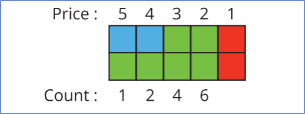

## QUESTION DESCRIPTION
A product marketer has several suppliers of a product. The stock is represented by an array of quantities for each supplier.
As items are purchased, the supplier raises the price by 1 unit per item purchased, reducing the marketer's profit per unit.
Assume the marketer's profit on any one item is the same as the number of those items the supplier has.
For example, the supplier has 4 units, the marketer's profit on the first unit sold is 4, then 3, then 2, and the last one the profit is 1.
Given the array of quantities at suppliers and the number of items ordered, determine the highest profit that can be generated.

### Example
inventory = [3, 5]
order = 6
Two suppliers have inventory = [3, 5] units to sell, and 6 items were ordered.
The maximum profit is made by selling 1 for 5, 1 for 4, and 2 at 3 and 2 at 2 units profit. The two suppliers are left with a unit of product each.
The maximum profit generated is 5 + 4 + 2*3 + 2*2 = 19.

### Function Description 
Complete the function maxProfit in the editor below.
maxProfit has the following parameter(s):
int inventory[n] : an array of integers representing units available in the stock per supplier
int order : a long integer, the number of items ordered

Returns : long int: the maximum profit achievable

### Constraints
1 ≤ n ≤ 10
1 ≤ inventory[i] ≤ 10 , , where 0 ≤ i < n
1 ≤ order ≤ sum(inventory)

Sample Case 1
Sample Input 1
STDIN	Function
----- 	-------- 
5 		→ inventory[] size n = 5
2 		→ inventory = [2, 8, 4, 10, 6]
8
4
10
6
20 		→ order = 20

***
## 내 풀이
~~~java
public static long maximumProfit(List<Integer> inventory, long order) {
        long result = 0;
        PriorityQueue<Integer> priorityQueue = new PriorityQueue<>(Collections.reverseOrder());
        priorityQueue.addAll(inventory);
        while (order > 0) {
        int removed = priorityQueue.poll();
        result += removed;
        priorityQueue.offer(—removed);
        order—;
        }

        return result;
        }
~~~